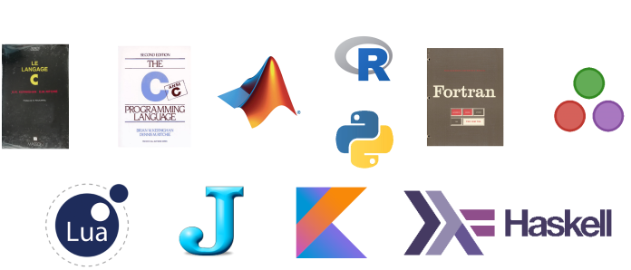

# So you're interested in Julia?
Cédric Simal
24/03/2020

---
# Motivation

---
# Disclaimer
I am **not** a Julia expert
This talk is mostly about my experience learning Julia
Links to proper learning ressources will be provided

---
# What to expect
1) How I got into Julia
2) What is Julia?
3) Julia's Ecosystem
4) Demo

---
# My programming history

---