<!-- _paginate: false -->


# So you're interested in Julia?
Cédric Simal
24/03/2020

---
# Motivation


---
# Disclaimer
I am **not** a Julia expert
This talk is mostly about my experience learning Julia
Links to proper learning resources will be provided

---
# What to expect
1) How I got into Julia
2) What is Julia, and why is it fast?
3) Julia's Ecosystem
4) Demo

---
# My programming history
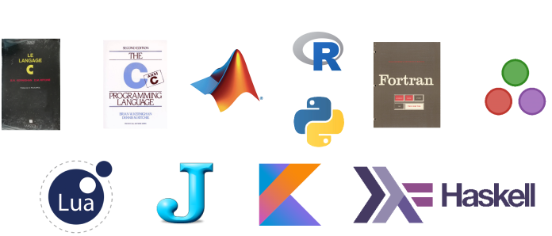

---
# Mathematical interests
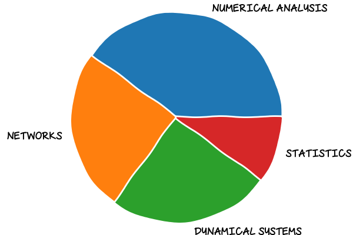

---
# Languages
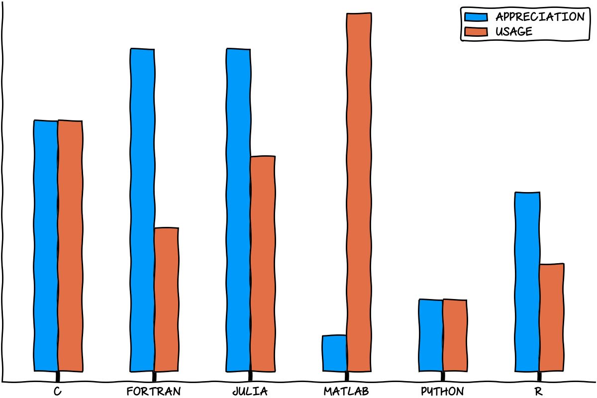

---
# My programming philosophy

* Performance matters
* Elegance matters
* The right tool for the right job
---
# Performance vs Abstraction
C/C++/Fortran | Python/R/Matlab
:------- | :-------
Compiled | Interpreted
Static Typing | Dynamic Typing
Limited Abstraction | Flexible
---
# Parallel computing
* Difficult in traditional languages (C, Fortran, ...)
* Naturally easy in Functional Programming (Erlang, Haskell)
* New generation of "hybrid" languages (Go, Julia, Kotlin, Rust, ...)

---
# Meet Julia

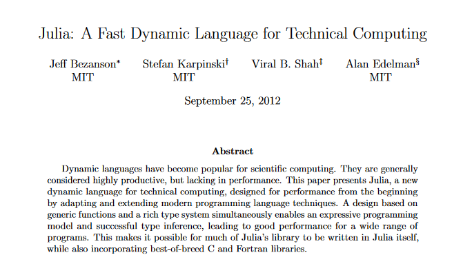

---
# Types
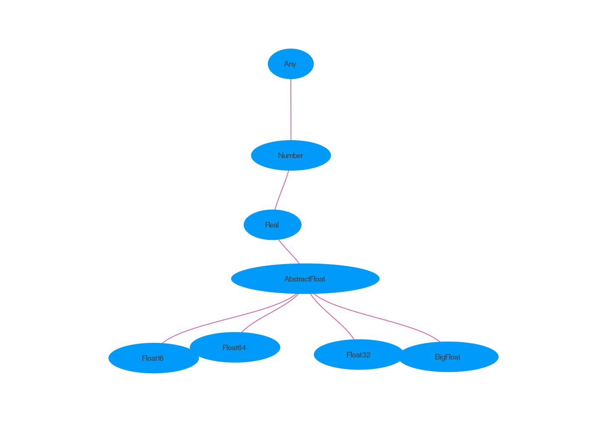

---
# Type System
Julia's type system is
* Dynamic, with optional type anotations `x::Int`
* Parametric `Vector{T}`
* Hierarchical (subtyping) `Float64 <: Real`

---
# Multiple Dispatch

```julia
julia> +
+ (generic function with 198 methods)

julia> methods(+)
# 198 methods for generic function "+":
[1] +(x::Bool, z::Complex{Bool}) in Base at complex.jl:282
[2] +(x::Bool, y::Bool) in Base at bool.jl:96
[3] +(x::Bool) in Base at bool.jl:93
[4] +(x::Bool, y::T) where T<:AbstractFloat in Base at bool.jl:104
[5] +(x::Bool, z::Complex) in Base at complex.jl:289
[6] +(a::Float16, b::Float16) in Base at float.jl:398
[7] +(x::Float32, y::Float32) in Base at float.jl:400
[8] +(x::Float64, y::Float64) in Base at float.jl:401
[9] +(z::Complex{Bool}, x::Bool) in Base at complex.jl:283
[10] +(z::Complex{Bool}, x::Real) in Base at complex.jl:297
...
```
---
# The secret sauce behind Julia's speed
Type system + Multiple dispatch + JIT compiling

---
# Postcard Demo!

---
# Performance
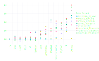
https://julialang.org/benchmarks/

---
# Packages

* Everything on Github (easy to create and publish)
* Standardized structure and testing
* Open source

---
# Networks

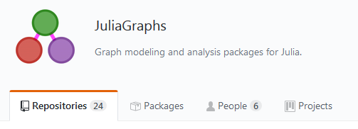

[LightGraphs.jl](https://github.com/JuliaGraphs/LightGraphs.jl)

---
# Numerical Integration

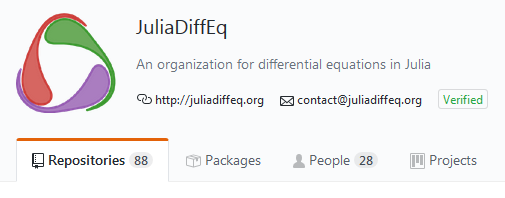
[JuliaDiffEq](https://github.com/JuliaDiffEq)


---
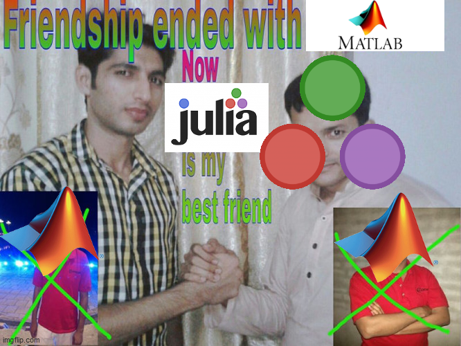

---
# Statistics
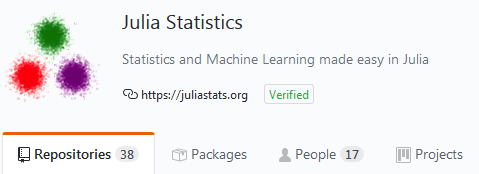
[JuliaStats](https://github.com/JuliaStats)

---
# Machine Learning
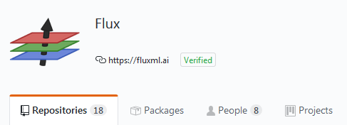
* [Flux](https://github.com/FluxML)
* [TensorFlow.jl](https://github.com/malmaud/TensorFlow.jl)

---
# Plotting
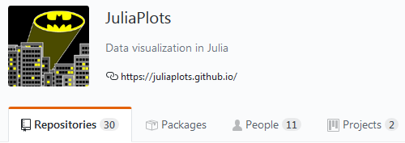
* [Plots.jl](https://github.com/JuliaPlots/Plots.jl)
* [Gadfly.jl](https://gadflyjl.org/stable/)

---
# Don't throw away your old code!
* Natively call C/Fortran functions

* [PyCall.jl](https://github.com/JuliaPy/PyCall.jl)
* [RCall.jl](https://github.com/JuliaInterop/RCall.jl)

---
# Demo Time!

---
# What's great about Julia
* Performance
* Composability
* Good practices
* Open source

---
# What's not so great about Julia
* Not quite mature
* Slow startup ("Time to first plot")
* Performance > Abstraction/Correctness

---
# Why Julia might not be for you

* Still in development
* *Programs*, not scripts

---
# That's all folks!
Slides, code and *many* links at
https://github.com/csimal/JuliaTalk

Send questions/comments/complaints to
cedric.simal@student.unamur.be
